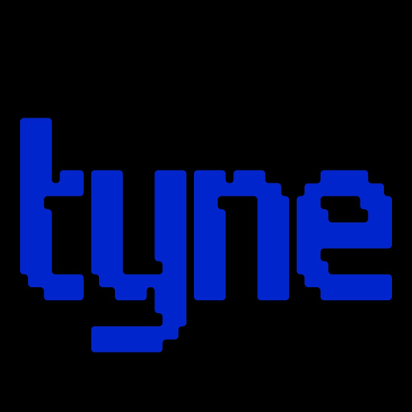

<p align="center">
  
</p>

<h1 align="center">Tyne</h1>

<p align="center"><strong>Goal-enforcement for AI-assisted coding.</strong></p>

Tyne keeps vibe-coding sessions on scope. Anchor work to a real task, isolate it on its own branch, then run **Validate & Review** before you merge — so what ships matches the ticket, not just the prompt.

> **Beta** — Core workflows (Threads, Validate & Review, Jira/Linear) are ready for daily use. Some integrations show *Coming soon* in-app.

---

## Why Tyne

AI assistants move fast. Scope drifts faster.

Tyne sits beside your editor and answers the questions that matter before you open a PR:

- Does this diff fulfill the **PM task / goal**?
- Is the **code** correct and maintainable?
- Are there **security** issues in what you just wrote?
- Do **compliance** policy checks flag anything (Max, opt-in)?
- Can I **fix it in the IDE** without leaving the flow?

---

## Install

1. Install **Tyne** from the Visual Studio Marketplace.
2. Open a git workspace.
3. Click the **Tyne** icon in the activity bar.
4. Sign in with **Continue with GitHub** (device flow — no password stored in Tyne).

**Requirements:** VS Code `^1.85.0` · git repository · GitHub account · Tyne plan **or** your own Claude/OpenAI key (BYOK)

---

## Core workflow

1. **Pick a task** — from Jira/Linear, or set a Solo goal on the Thread tab.
2. **Start Thread** — Tyne creates an isolated `tyne/<task>-…` branch.
3. **Code** — commit checkpoints (“stitches”) as you go.
4. **Validate & Review** — `Cmd/Ctrl+Shift+T` (or **Run Review** in the sidebar).
5. **Fix findings** — apply a patch, open **Fix in IDE**, or use the editor Quick Fix.
6. **Tie the Knot** — review findings, then merge when *you* accept the residual risk (Override when depth is partial or ship advice is not approve).

---

## Validate & Review

One combined report — not four separate tools. Tyne reviews your *changes*, not your whole repo by default.

| Layer | What you get |
| ----- | ------------ |
| **PM / scope alignment** | Checks the diff against the linked Jira/Linear task or Thread Solo goal. |
| **Code review** | Correctness, bugs, maintainability, architecture, and “vibe-code” smells. |
| **Security review** | Deterministic + AI security findings with file/line evidence and remediations. |
| **Compliance checks** | Opt-in policy checks on the reviewed diff (Max). Advisory — not a certification or audit. |
| **Quality scorecard** | Complexity, clones, local quality signals, and next actions. TypeScript/JavaScript use the local TypeScript compiler; other languages use regex heuristics unless optional tree-sitter grammars are present under `media/tree-sitter/`. |

**Scopes:** Auto · staged · unstaged · last commit · selected commit.

Reports include a score, risk level, completed/pending goals, security findings, missing tests (Pro/Max), and a full report on higher tiers.

### Fix findings without leaving the editor

When Validate & Review surfaces an issue, you can:

- **Fix** — apply a verified patch in one click (when Tyne can produce one).
- **Fix in IDE** — hand the finding to your AI agent with a ready-made prompt in the editor.
- **Quick Fix** — use VS Code’s lightbulb / Quick Fix menu (`Tyne: apply suggested fix…`) on applyable diagnostics.
- **Ignore** / **Undo** — dismiss noise or reverse an applied patch.

---

## Tasks & PM integrations

Pull assigned work into Tyne, start a Thread from a ticket, validate against that ticket, and optionally post feedback or mark the task done.

| Integration | Status |
| ----------- | ------ |
| GitHub | Live — auth, branches, draft PRs |
| Jira | Live — OAuth, pull, create/edit, comments |
| Linear | Live — OAuth, pull, create/edit, comments |

**Core:** one PM tool (Jira *or* Linear). **Pro / Max:** both.

### Create tasks from a story or epic

On Pro/Max, decompose a large story into implementable subtasks (**Create Tasks from Story**) and optionally push them back to Jira or Linear.

---

## Threads, commits & automation

- **Threads** — goal-anchored sessions with branch isolation and drift detection.
- **Branches** — switch and inspect Tyne thread branches.
- **Commits** — history, velocity, and AI commit message synthesis.
- **Time** — lightweight time tracking per thread.
- **Automation / Project Lead Mode** — workspace prep, drift sensitivity, validation reminders, preview/post PM feedback, and mark task done.

Validation reminders are advisory and rate-limited (large edits, new diagnostics, long sessions). Configurable in settings.

---

## Privacy & AI access

Tyne is designed to keep source local by default. Choose a mode in Settings:

| Mode | Behavior |
| ---- | -------- |
| **Cloud** | Hosted models via Tyne’s managed backend. |
| **Privacy Enhanced** | Client-side redaction/sanitization before anything leaves your machine. |
| **Local Compliance** | Prefer local engines; minimize outbound data. |

**BYOK (Bring Your Own Key):** use your Claude or OpenAI key. Requests go to the provider — the key is not sent to Tyne’s backend. US/EU data residency is configurable for managed paths.

---

## Plans

Tyne plans map as **Core (Free)** · **Pro** · **Max**. New accounts start on Core.

### At a glance

| Feature | Core (Free) | Pro | Max |
| ------- | :---------: | :-: | :-: |
| Threads, stitches, Tie the Knot | ✓ | ✓ | ✓ |
| Validate & Review (code + security + quality) | ✓ | ✓ | ✓ |
| Fix / Fix in IDE / Quick Fix | ✓ | ✓ | ✓ |
| Hosted AI models (managed path) | ✓ (5/mo) | ✓ | ✓ |
| Bring your own key (Claude / OpenAI) | ✓ (optional) | ✓ (optional override) | ✓ (optional override) |
| Managed Validate & Review / month | 5 | 50 | Unlimited |
| PM / scope alignment vs Jira·Linear or Solo goal | ✓ | ✓ | ✓ |
| Missing-test review | ✓ | ✓ | ✓ |
| Full validation report | ✓ | ✓ | ✓ |
| Validation trends & richer history | — | ✓ | ✓ |
| Live PM tools | Jira **or** Linear | Jira + Linear | Jira + Linear |
| Create / edit Jira & Linear tasks from Tyne | — | ✓ | ✓ |
| Story / epic → subtasks | — | Up to 3 | Up to 5 |
| Review context (diff size / files) | ~120k · 12 files | ~120k · 12 files | ~200k · 20 files |
| Custom review guardrails | — | — | ✓ |
| Opt-in compliance policy checks | — | — | ✓ |
| Largest / strongest hosted models | — | ✓ | ✓ (incl. pro-class) |

### Core (Free)

Built for trying Tyne on real work — hosted managed reviews included (5/month).

- Goal-anchored **Threads** with branch isolation
- **Validate & Review**: PM/scope alignment, code review, security findings, missing-test signals, and quality scorecard (same pipeline quality as Pro; volume-capped)
- **Fix**, **Fix in IDE**, and editor **Quick Fix** on applyable findings
- Optional **BYOK** (Claude or OpenAI) — your key stays on your machine / goes to the provider, not Tyne’s billing backend
- **5** managed validations per month (hard-capped, including BYOK on Core)
- **One** connected PM tool (Jira *or* Linear)
- Linked PM task is optional — Solo goals work for Validate & Review

### Pro

For daily shipping with more volume.

- Everything in Core, plus **50** managed Validate & Review runs per month
- **Both** Jira and Linear connected
- Create and edit tasks from Tyne; **story/epic decomposition** (up to **3** subtasks)
- Validation trends and richer history
- Larger hosted model mix

### Max

For the deepest reviews and team guardrails.

- Everything in Pro, with **unlimited** managed Validate & Review
- Largest context (~200k diff chars, ~20 relevant files) and strongest hosted model mix
- **Custom guardrails** for your repo/team rules
- **Opt-in compliance policy checks** on the reviewed diff (advisory — not a certification or audit)
- Story/epic decomposition up to **5** subtasks

Upgrade from **Settings → Plan**, or from the volume prompt after a Core review when quota is low.

---

## Commands worth knowing

| Command | Action |
| ------- | ------ |
| `Tyne: Validate & Review` | Run the combined review (`Cmd/Ctrl+Shift+T`) |
| `Tyne: Validate & Review Last Edit` | Review the last edit scope |
| `Tyne: Open Validate & Review Reports` | Browse past reports |
| `Tyne: Set Claude/OpenAI API Key` | Configure BYOK |
| `Tyne: Connect GitHub` / `Reconnect GitHub` | Account connection |

---

## Key settings

Under **Tyne** in VS Code Settings:

- `tyne.byokProvider` — `claude` or `openai`
- `tyne.validationReminders.enabled` — automatic Validate & Review nudges
- `tyne.validateReviewLineThreshold` — lines changed before a reminder (default `50`)
- `tyne.projectLeadMode` — prep, drift detection, synth commits, auto ticket close
- `tyne.defaultBranch` — base branch for new threads (default `main`)
- `tyne.driftSensitivity` — `low` / `medium` / `high`
- `tyne.supabaseUrl` / `tyne.supabaseUrlEu` — managed backends (US / EU)

---

## Important notes

- **Compliance checks are advisory.** They are policy scans on the reviewed diff — not a compliance certification, audit, legal opinion, or guarantee of security.
- Tyne reviews **your changes** in context. It is not a full-repository static analysis suite.
- Beta software: expect rapid iteration; please report issues from the in-app beta bug reporter.

---

## Development

```bash
npm install
npm run compile     # type-check
npm run package     # production bundle → dist/extension.js
npm test            # compile + node:test suite
npx @vscode/vsce package --allow-missing-repository   # build .vsix
```

---

## License

MIT © [tyne.io](https://tyne.io)
